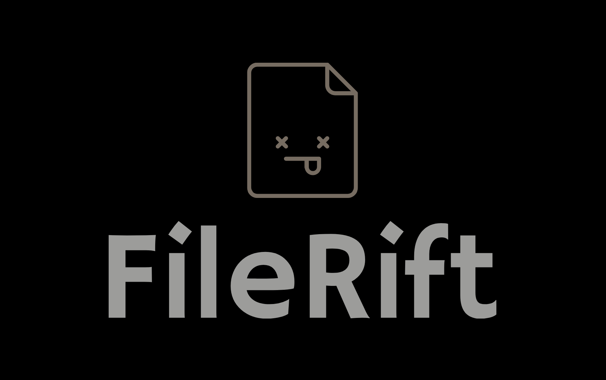

<<<<<<< HEAD
# FileRift
A peer to peer file sharing Web Application using WebRTC
AB
A peer to peer file sharing Web Application using WebRTC https://glosse.github.io/FileRift/
=======

# FileRift 💥

A peer to peer file sharing Web Application using WebRTC                   
To use the site click [here](https://glosse.github.io/FileRift/)!

## Features
- Cross platform
- Secure code generation for peer connection
- Light/dark mode toggle
- Live chat for communication

## Authors

- [@Aradhya](https://github.com/aradhyabob)
- [@Arnav](https://github.com/0Arnav0)
- [@Aniket](https://github.com/aniketmurkutkar)
- [@Harsh](https://github.com/glossE)

## Contributing

Contributions are always welcome!

>>>>>>> aea4b005014641c24432d969d97d52bb15893596
